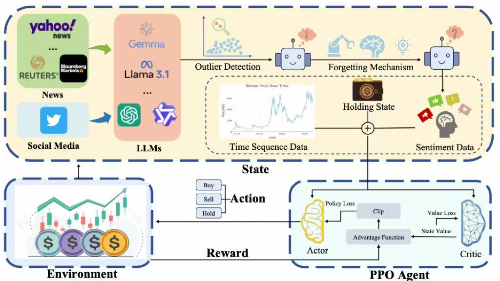
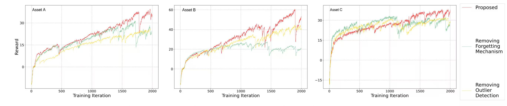
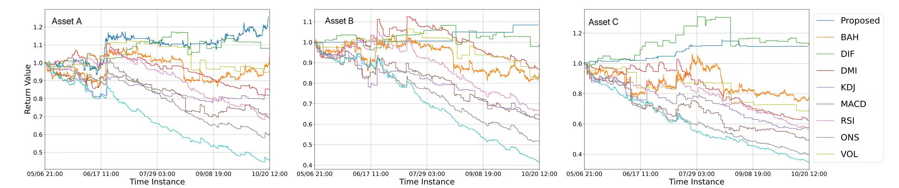

# Real-Time Trading Strategy System

## Project Overview

This repository presents the **reinforcement learning trading framework I designed and implemented** for cryptocurrency markets, using real-world historical market data and transaction-cost-aware evaluation.

The system was developed as part of our IEEE CIFEr 2025 research on cryptocurrency trading with multi-source sentiment signals. The full study evaluates the strategy on hourly BTC, ETH, and DOGE market data and also includes a short live Bitcoin trading experiment.

While an upstream research team developed the multi-LLM sentiment-analysis pipeline, **all reinforcement-learning, trading-environment, training, and backtesting components in this repository were implemented by me**.

My work focuses on the downstream quantitative trading module, including:

- A PPO-based trading agent with an LSTM-enhanced actor–critic network
- A 24-step rolling market-state representation combining OHLCV data, technical indicators, and externally generated sentiment features
- Buy / Sell / Hold decision-making with position-aware execution logic
- Transaction-cost-aware trading and portfolio-value tracking
- A full on-policy PPO training pipeline with Generalized Advantage Estimation and clipped policy updates
- Out-of-sample backtesting on real cryptocurrency market data
- Visualisation tools for analysing agent behaviour, trading decisions, and strategy performance

The sentiment-feature generation module is not included in this repository. Sentiment signals are treated as external inputs supplied by the upstream research pipeline.

This repository contains the PPO-based trading implementation associated with our IEEE CIFEr 2025 study, including additional implementation details in state construction, technical-feature engineering, and LSTM-based policy modelling:

[*Enhancing Cryptocurrency Trading Strategies: A Deep Reinforcement Learning Approach Integrating Multi-Source LLM Sentiment Analysis*](https://ieeexplore.ieee.org/document/10975733)  
**IEEE CIFEr 2025**



---

## Results

In the full study, the end-to-end strategy combining this trading module with externally generated sentiment features was evaluated on hourly real-market data for **Bitcoin (BTC), Ethereum (ETH), and Dogecoin (DOGE)**, with a **0.1% transaction fee** applied to executed trades.

| Asset | Annualized Return | Sharpe Ratio |
|:------|------------------:|-------------:|
| BTC | **72.34%** | **2.53** |
| ETH | **19.91%** | **2.10** |
| DOGE | **27.22%** | **2.69** |

The proposed strategy achieved the **highest Sharpe ratio across all three cryptocurrency instances** among the evaluated methods. It also achieved the highest annualized return on BTC and ETH.

For DOGE, the CCI benchmark produced a higher annualized return (36.08% vs. 27.22%), while the proposed strategy achieved a substantially higher Sharpe ratio (2.69 vs. 1.14), indicating stronger risk-adjusted performance.

In addition to historical out-of-sample evaluation, the complete research system was deployed in a **half-month live Bitcoin trading experiment**, achieving an approximately **3% return**.

---

## Features

- PPO-based actor–critic trading agent with sequential state modelling
- Real-world cryptocurrency market data with hourly observations
- Buy / Sell / Hold action space with position-aware execution constraints
- Transaction-cost-aware trading environment and portfolio accounting
- Integration interface for externally generated sentiment signals
- On-policy PPO training with Generalized Advantage Estimation (GAE)
- Out-of-sample evaluation across BTC, ETH, and DOGE
- PyTorch implementation supporting CPU and GPU training
- Visualisation of rewards, trading actions, portfolio value, and test performance

---

## Core Workflow (Pseudocode)

The following pseudo-code summarizes the core **PPO-LSTM training pipeline** implemented in this project.
It highlights how the agent interacts with the execution-aware trading environment, collects on-policy trajectories, computes advantages using **Generalized Advantage Estimation (GAE)**, and performs clipped PPO optimisation.

```python
# PPO-LSTM Training Loop (Simplified Pseudo-code) 
initialize PPO(agent = LSTM(policy_input_features))

for episode in range(max_episodes):
    s = env.reset()
    h = agent.init_hidden()  # initialize hidden state
    done = False

    while not done:
        # 1. Forward pass through policy network
        prob, h_next = agent.policy(s, h)
        a = sample_action(prob)
        s_next, r, done = env.step(a)

        # Reward is based on next-period price movement,
        # adjusted according to action and current position state.
        # Transaction costs are handled by the execution logic.

        # 2. Store experience (on-policy)
        agent.put_data((s, a, r, s_next, prob[a]))
        s, h = s_next, h_next

    # 3) PPO update (multiple epochs per episode)
    for epoch in range(K):
        v_s      = agent.value(s)
        v_s_next = agent.value(s_next)

        # GAE advantage estimation
        advantage = compute_GAE(rewards=r, values=v_s, next_values=v_s_next)

        # ratio = πθ(a|s) / πθ_old(a|s)   (old prob from buffer)
        ratio        = new_policy_prob / old_policy_prob
        clipped_term = clip(ratio, 1 - ε, 1 + ε) * advantage
        policy_loss  = -min(ratio * advantage, clipped_term)
        value_loss_  = value_loss(v_s, r + γ * v_s_next)

        optimize(policy_loss + value_loss_)
```  

---

## Core Modules

### `RL_brain.py` — PPO Agent

This module implements the **PPO agent with an LSTM-enhanced actor–critic architecture**.
It defines the policy network, value network, and the entire optimisation pipeline.

- Model Architecture:
    - Combines a feedforward feature extractor with an `LSTM layer` for temporal modelling.
    - `pi()` outputs the probability distribution (policy network).
    - `v()` estimates the state value (value network).
- Core Training Logic `train_net()`:
    - Computes `Generalized Advantage Estimation (GAE)` for variance-reduced advantage calculation.
    - Implements `PPO-Clip` to stabilise policy updates.
    - Optimises actor and critic jointly using the combined loss.
- On-Policy Experience Buffer
    - `put_data()` collects (`state, action, reward, prob`) tuples.
    - `make_batch()` constructs mini-batches for PPO updates.
    - Buffer is cleared after each PPO update to maintain on-policy learning.

### `stock_env.py` — Trading Environment

This module implements a **time-series trading environment** driven by sliding-window technical features.
It serves as the interface between the agent and the historical market execution and portfolio-accounting logic.

- State Representation:
    - Each state combines a `24-step rolling window` of OHLCV data, technical indicators, and externally generated sentiment features, together with a position flag.
    - The rolling-window features are flattened into the model state and processed by an LSTM-enhanced actor–critic network.
- Action Space:
    - 3 discrete actions: `Buy`, `Sell`, `Hold`.
    - Execution depends on the agent's current holding state.
- Reward Design:
    - Uses next-period price changes as the base reward signal, with action- and position-dependent adjustments for Buy, Sell, and Hold decisions.
    - Transaction costs are incorporated separately through the portfolio execution logic.
- Backtesting Visualisation:
    `draw()` plots: `price series`, `positions`, `cumulative PnL`, `agent decisions`

### `run_this(ppo).py` — Execution Script

This script integrates the PPO agent, environment, training loop, and backtesting routine.

Core functions:
- Data Preprocessing:
    - Applies `StandardScaler` for feature normalisation.
    - Constructs training/testing splits for sequential evaluation.
- PPO Training Loop:
    - Interacts with the environment to collect on-policy trajectories.
    - Calls `put_data()` to store `(state, action, reward, prob)` tuples.
    - Performs PPO updates after an initial warm-up period using collected on-policy trajectories.
- Backtesting & Evaluation
    - Evaluates the current policy on the held-out test split during training.
    - Uses `BackTest()` with a greedy policy (`argmax(prob)`).
    - Generates plots for: `PnL curves`, `action sequences`, `reward trends`

---

## Example Output

Below are representative visualisations from the training and evaluation pipeline:
- Reward trajectory during training
    
- Cumulative portfolio value vs benchmark reference
    
- Out-of-sample evaluation under multiple test scenarios
    

---

## Future Work

1. **Algorithmic Enhancements** – extend the framework to support alternative RL algorithms (e.g., PPO with entropy annealing, SAC, or Transformer-based policies) and enable more robust hyperparameter tuning.
2. **Feature Engineering** – incorporate additional time-series features such as volatility estimators, liquidity proxies, and microstructure-inspired indicators to strengthen state representation.
3. **Execution & Risk Modelling** – enrich the environment with more realistic transaction-cost models, slippage assumptions, position-change penalties, and exposure constraints for improved realism.
4. **Evaluation & Robustness** – add cross-validation across market regimes, Monte-Carlo stress testing, and richer diagnostic tools to analyse sensitivity, stability, and policy behaviour.
5. **System Reliability** – improve logging, exception handling, and dataset validation to support reproducibility and clearer interpretation of agent behaviour.

---

## Requirements

- Python 3.7+
- PyTorch >= 1.7
- numpy
- pandas
- matplotlib
- scikit-learn
- The implementation supports both CPU and GPU acceleration and was trained on a personal NVIDIA GPU using PyTorch.
